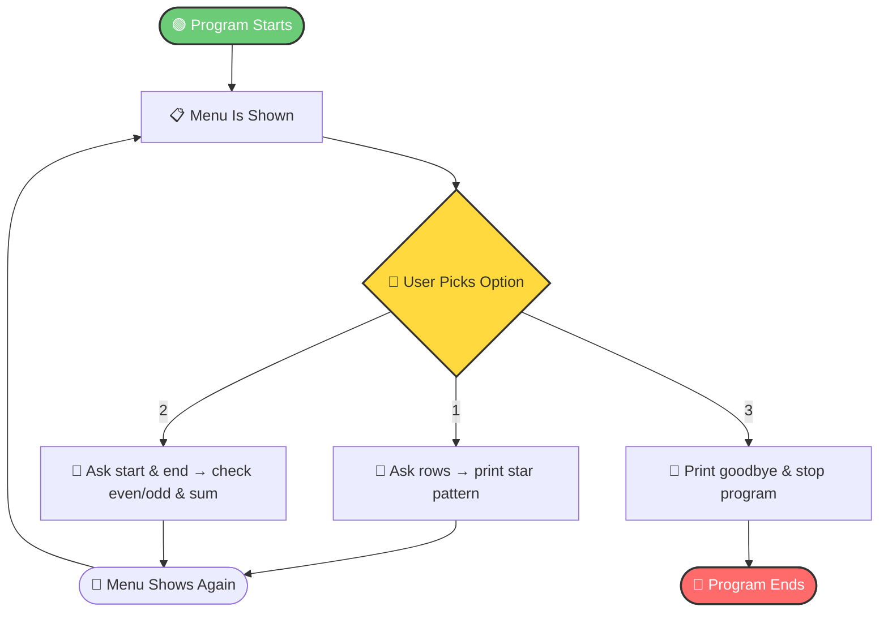

<div align="center">


&nbsp;&nbsp;&nbsp;
&nbsp;&nbsp;&nbsp;


[](https://git.io/typing-svg)


</div>

<div align="center">

### 🧭 Table of Contents


[Overview](#-project-overview) • [Objective](#-objective) • [Demo](#-example-output) • [Flow](#-program-flow) • [Features](#-features) • [Skills](#-skills-demonstrated) • [Getting Started](#-getting-started) • [Structure](#-project-structure) • [Video](#-video) • [Assumptions](#️-assumptions) • [Tech Stack](#️-tech-stack) • [Contact](#-contact-me)

</div>


## 📌 Project Overview


**Logic Box** is a fun, menu-based Python program that runs in the console. It lets the user pick from a small menu and then does one of two things: draw a star pattern, or look closely at a range of numbers (telling which are even, which are odd, and adding them all up).

The program keeps showing the menu again and again until the user chooses to exit, so it works like a small, repeatable tool rather than a one-time script.

<br clear="right">

<div align="center">

<table>
<tr>
<td width="33%" align="center">

<br/>
🔺 <b>Pattern Printing</b><br/><sub>nested <code>for</code> loops</sub>

</td>
<td width="33%" align="center">

<br/>
🔢 <b>Number Analysis</b><br/><sub>even / odd + sum</sub>

</td>
<td width="33%" align="center">

<br/>
🔁 <b>Menu Loop</b><br/><sub><code>while True</code> + <code>match</code></sub>

</td>
</tr>
</table>

> Built for **Logic Box — Red & White Skill Education.** 🎓

</div>


## 🎯 Objective


Create a small interactive Python console app that shows how loops, conditions, and menus work together:

- 🔁 Showing a repeating menu with `while True`
- 🎯 Choosing what to do next with `match` / `case`
- 🔺 Using nested loops to build a pattern
- ⚖️ Using `if` / `else` to check even and odd numbers
- ➕ Adding numbers together in a loop

<br clear="left">

## ✨ Features

<div align="center">

</div>

| # | Feature | Description |
|:---:|---|---|
| 🧾 | **Menu** | A simple numbered menu is shown every time the program runs |
| 🔺 | **Pattern Builder** | Asks for a number of rows and prints a star pattern that grows one row at a time |
| 🔢 | **Range Scanner** | Asks for a start and end number, then labels each as *Even* or *Odd* |
| ➕ | **Running Total** | Adds up every number in the range and displays the sum |
| 🚪 | **Clean Exit** | Exits the program with a friendly goodbye message |
| 🔁 | **Auto Repeat** | Keeps looping back to the menu after each task, no restart needed |

## 🌊 Program Flow

<div align="center">

</div>



| Step | Stage | Description |
|:---:|---|---|
| 1 | **Show Menu** | Print the welcome text and the three menu options |
| 2 | **Take Choice** | Read the user's choice as a number and match it to an option |
| 3 | **Do the Task** | Run the pattern printer, the number analyzer, or exit |
| 4 | **Repeat** | Go back to Step 1 unless the user chose to exit |

## 🎬 Example Output

<div align="center">

</div>

<details open>
<summary><b>🔺 Option 1 — Pattern (Rows = 4)</b> </summary>

```
Welcome to the Pattern Generator and Number Analyzer!
Select an option:
1. Generate a Pattern
2. Analyze a Range of Numbers
3. Exit
Enter your Choice:1
Enter the number of rows for the pattern: 4
Pattern:

*
**
***
****
```

</details>

<details>
<summary><b>🔢 Option 2 — Number Range (2 to 5)</b> </summary>

```
Enter your Choice:2
Enter the start of the range:2
Enter the end of the range:5
Number 2 is Even
Number 3 is odd
Number 4 is Even
Number 5 is odd
Sum of all numbers from 2 to 5 is: 14
```

</details>

<details>
<summary><b>🚪 Option 3 — Exit</b> </summary>

```
Enter your Choice:3
Exiting the program. Goodbye!
```

</details>

> 💡 Notice the pattern's first line is always blank — that's because the loop counts rows from `0`, so the very first row prints zero stars. This is a normal, expected part of how the loop is written.

## 🎯 Skills Demonstrated

<div align="center">


-████████████-FF6B6B?style=flat-square)


-███████████-9D4EDD?style=flat-square)

</div>

- Building a menu that repeats using `while True`
- Directing the program's flow with `match` / `case`
- Printing shapes using loops inside loops
- Checking even and odd numbers with the `%` operator
- Keeping a running total while looping through a range

## ✅ Assignment Requirements Checklist

<div align="center">

</div>

| Requirement | Status |
|---|:---:|
| Show a repeating menu until the user exits | ✅ |
| Let the user generate a star pattern | ✅ |
| Let the user analyze a range of numbers | ✅ |
| Show which numbers are even and which are odd | ✅ |
| Calculate and show the sum of the range | ✅ |
| Give the user a clean way to exit the program | ✅ |
| Uploaded with a simple, descriptive README | ✅ |

## 🚀 Getting Started


### Prerequisites


### Installation

```bash
git clone https://github.com/<your-username>/logic-box.git
cd logic-box
```

### Usage

```bash
python Logic_Box.py
```

When it runs, you'll see a menu. Type:
- `1` to draw a star pattern 🔺
- `2` to check numbers in a range for even/odd and get their sum 🔢
- `3` to exit the program 👋

<br clear="right">

## 🎥 Video

<div align="center">

</div>

Video link :

## 📁 Project Structure

```
logic-box/
├── Logic_Box.py   # Main script
└── README.md      # Project documentation
```

## ⚠️ Assumptions


- The user always types a valid whole number for the menu choice; entering letters or symbols will crash the program, since no extra error handling was added beyond the negative-rows check.
- For Option 1, a negative number of rows shows an "Enter valid Number" message instead of a pattern, but the program does not ask again — it simply moves on.
- For Option 2, the start value is expected to be less than or equal to the end value; if `start` is bigger than `end`, the range will simply be empty and nothing will print.
- Choosing an option outside 1, 2, or 3 currently does nothing and just returns to the top of the loop, since there's no "invalid choice" message.

<br clear="left">

## 🛠️ Tech Stack

<div align="center">


</div>

## 📬 Contact Me

<div align="center">


[](mailto:shreyanghan205@gmail.com)

</div>

<div align="center">


*"Quality is our Motto."* — Red & White Skill Education 🎓


</div>
